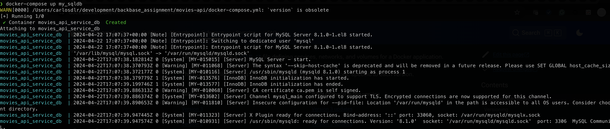
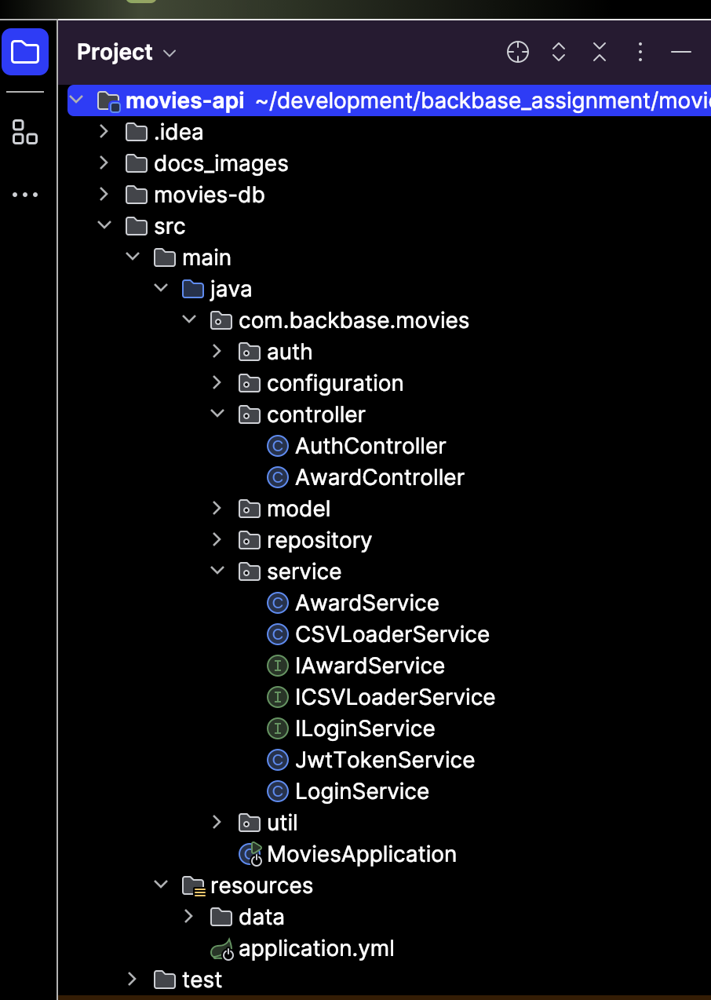
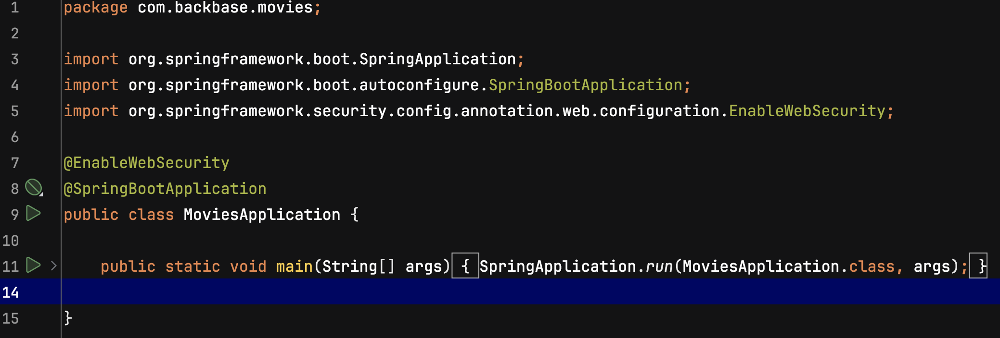
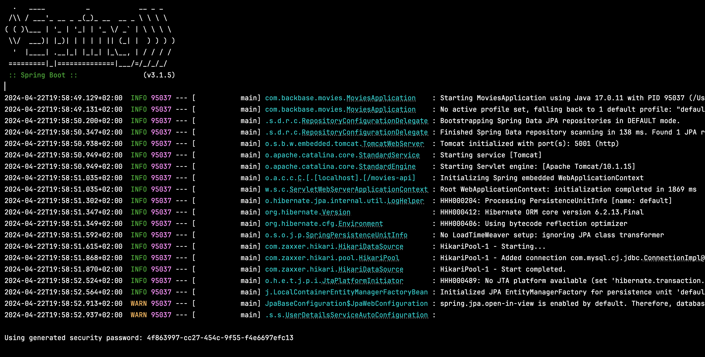
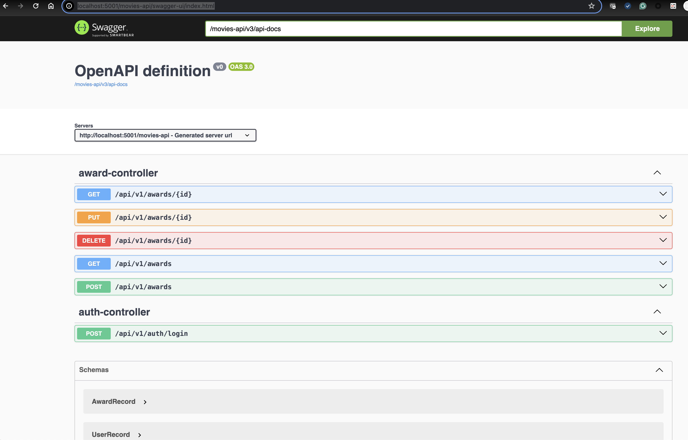
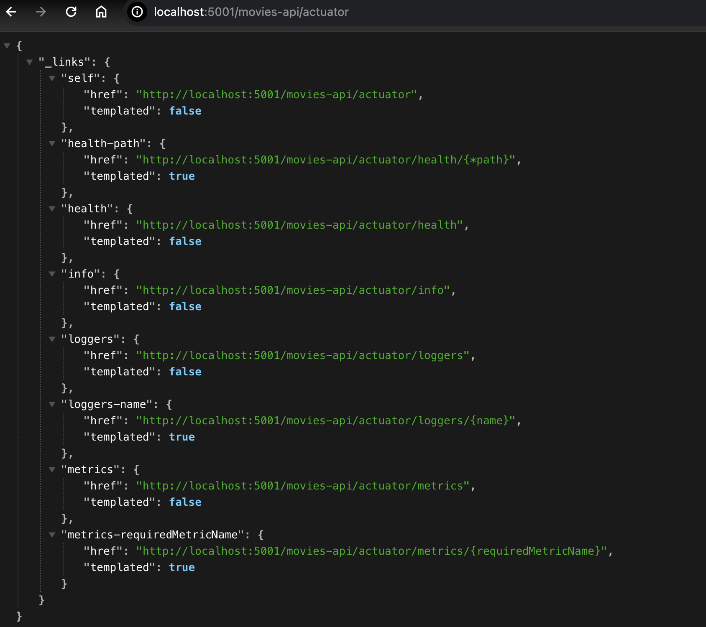
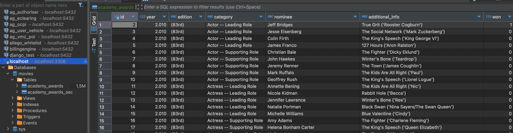

# Running the service locally

## Requirements
In order to run the service locally is necessary to have:

- Intellij IDEA

Without docker in the local machine
- graalvm-jdk-17
- mysql latest version

---------------------------
- Docker
- Docker-compose

## Running on IDE mode for local development

in the terminal run the command on the root path of the service as shown below
``
docker-compose up my_sqldb
``

You will see something like the image below

### Connecting api service from intellij to the db

Now that the database is running open the movies-api project
in intellij IDEA and run the entrypoint class MoviesApplication like is show below

The IDE will allow to run this main class, press in the play button.

If everything went well you will see in the console log something like the below

also you will be able to see the swagger documentation ui in the url

http://localhost:5001/swagger-ui/index.html as below

and the actuator endpoint for telemetry in the url

http://localhost:5001/actuator

Note: The service at startup time will read the csv file with the information
of the oscar's awards once, if you want to recreate the data you can either truncate the table or recreate the container, 
it's recommended to use a mysql client to check that the data
has been loaded check https://dbeaver.io/ for more info.

You should see something like the image below at DB level

