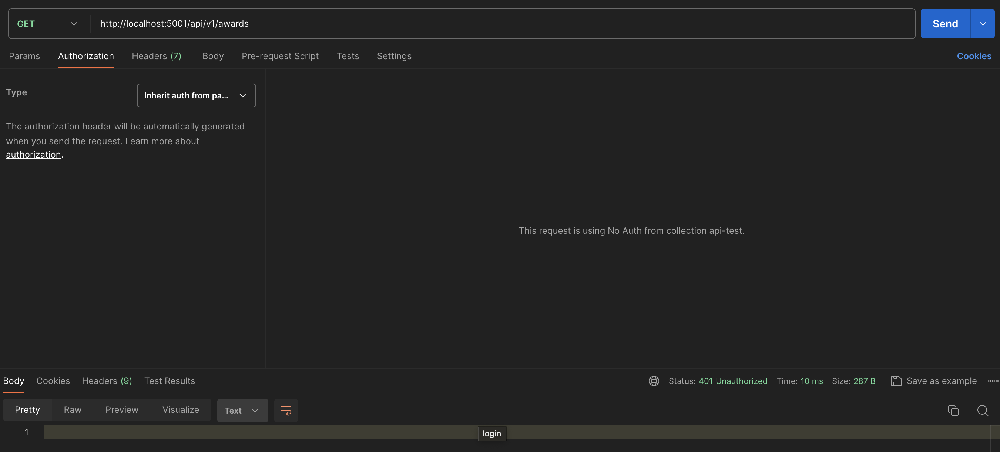
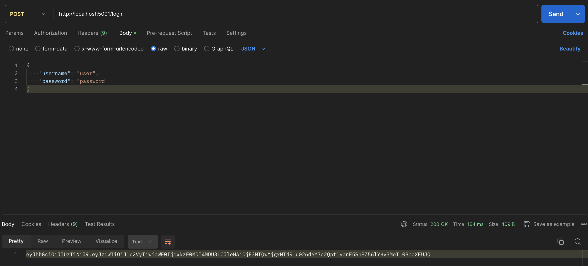
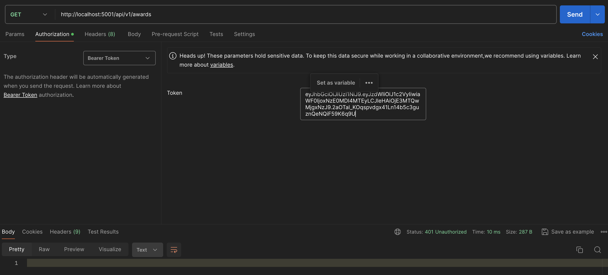
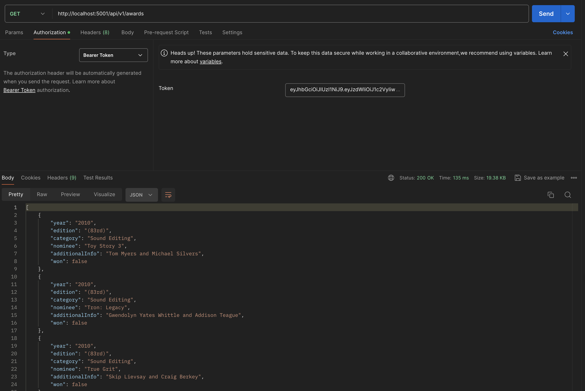

# Testing The API with postman

After having running locally the service with the steps explained in [how_to_run.md](how_to_run.md), we
will be able to reach the endpoints let's try reaching the get all awards (to see more detail about the endpoints go 
to the swagger documentation ui).

After calling the get all awards you will get a 403 http status code due to is required to login
in order to get a JWT token

## Getting a JWT token

To get a JWT token first we need to call the login endpoint as shown below

Provide the authorization http header with the bearer token generated in the previous step

After adding the JWT token you will be able to call the api endpoints as shown below

