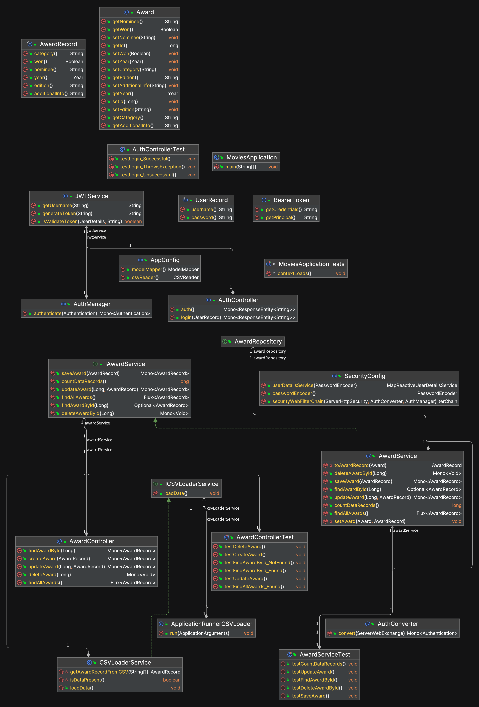

# Movies API Solution

This a micros service solution based on springboot 3 and java 17.

This solution provides an API to interact with a oscars winners data base.

## Design decisions

- Application runner to populate the DB (Mysql)
- Using reactor framework to allow to the API scale using reactive and async approach for the api
- JWT token implementation using a static user authentication to later integrate with a OAuth services
- Docker for containerization for later deploy in K8s environment if required
- Following standard 3 layer app architecture (controller, service, repository)
- Using graalvm-jdk-17 virtual machine to allow polyglot microservices(python, node, java) and further starup times improvement using native images 

## Uml Class Diagram

